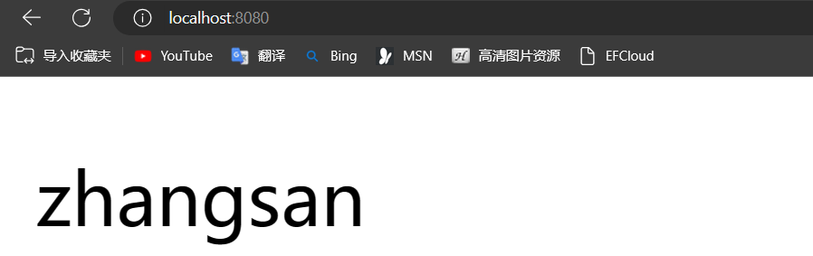

# Thymelaf模板引擎技术

# 什么是Thymeleaf？

	Thymeleaf 是一种用于构建Java web应用程序的模板引擎。它可以在服务器端将静态的HTML模板与动态的数据进行结合，生成最终的HTML页面，从而实现前后端的数据交互。

	Thymeleaf 提供了丰富的标签和属性，使开发人员可以方便地操作HTML元素及其属性，并在模板中嵌入动态数据。它支持基本的逻辑判断、循环迭代、变量定义等功能，可以根据数据的不同情况来动态地生成页面内容。

	Thymeleaf 的语法简洁易懂，模板文件可以直接在浏览器中预览，这样可以更方便地进行页面设计和调试。同时，Thymeleaf 与Spring框架紧密集成，可以通过表达式语言访问后端的Java对象，进一步实现前后端的数据交互。

​`Thymeleaf官网:`​[Thymeleaf](https://www.thymeleaf.org/)

# 初学Thymeleaf

## 第一个Thymeleaf程序

1. 导入Thymeleaf模板引起依赖

    ```xml
    <!--导入Thymeleaf模板引擎依赖-->
    <dependency>
    	<groupId>org.thymeleaf</groupId>
    	<artifactId>thymeleaf</artifactId>
    	<version>3.1.1.RELEASE</version>
    </dependency>
    ```
2. Java代码实例

    ​`HelloThymeleafDemo01`

    ```java

    import org.thymeleaf.TemplateEngine;
    import org.thymeleaf.context.Context;

    public class HelloThymeleafDemo01 {
        public static void main(String[] args) {
            //创建模板引擎
            TemplateEngine templateEngine = new TemplateEngine();
            //准备模板
            String input = "<input type='text' th:value='HelloThymeleaf'></input>";
            //准备数据，使用Context
            Context context = new Context();
            //调用引擎处理模板和数据
            String process = templateEngine.process(input, context);
            System.out.println("结果数据:"+process);
        }
    }

    ```
3. 总结：

    1. 创建模板引擎
    2. 准备模板
    3. 准备数据，使用Context
    4. 调用引擎处理模板和数据

## 模板引擎读取电脑磁盘中的模板文件

```Java
public class MyTest {
    //测试模板引擎读取磁盘中的模板文件
    @Test
    public void t1(){
        TemplateEngine templateEngine = new TemplateEngine();
        //读取磁盘中的模板文件
        ClassLoaderTemplateResolver templateResolver = new ClassLoaderTemplateResolver();
        //设置模板引擎的为：Resolver
        templateEngine.setTemplateResolver(templateResolver);
        //指定数据
        Context context = new Context();
        context.setVariable("name","lkj");
        //处理模板
        String process = templateEngine.process("main.html", context);
        System.out.println(process);
    }
}

```

## 设置模板引擎的路径(前缀、后缀)

设置我们的前缀、后缀就得使用我们的`ClassLoaderTemplateResolver()`​类的

1. ​`setPrefix()`​：方法设置前缀
2. ​`setSuffix()`​：方法设置后缀
3. 代码实例

    ```java
        /**
         * 设之我们模板引擎的路径(前缀\后缀)
         */
        @Test
        public void t2(){
            TemplateEngine templateEngine = new TemplateEngine();
            ClassLoaderTemplateResolver templateResolver = new ClassLoaderTemplateResolver();
            //设置前缀(必须指定在resource资源文件下)
            templateResolver.setPrefix("template/");
            //设置后缀
            templateResolver.setSuffix(".html");

            templateEngine.setTemplateResolver(templateResolver);

            Context context = new Context();
            context.setVariable("name","lkj");
            String process = templateEngine.process("main.html", context);
            System.out.println(process);
        }
    ```

# SpringBoot整合Thymeleaf

1. 创建Spring Boot项目

    1. ​`pom.xml`

        ```xml
        <?xml version="1.0" encoding="UTF-8"?>
        <project xmlns="http://maven.apache.org/POM/4.0.0" xmlns:xsi="http://www.w3.org/2001/XMLSchema-instance"
                 xsi:schemaLocation="http://maven.apache.org/POM/4.0.0 https://maven.apache.org/xsd/maven-4.0.0.xsd">
            <modelVersion>4.0.0</modelVersion>
            <parent>
                <groupId>org.springframework.boot</groupId>
                <artifactId>spring-boot-starter-parent</artifactId>
                <version>2.7.13</version>
                <relativePath/> <!-- lookup parent from repository -->
            </parent>
            <groupId>com.lkjedu.boot</groupId>
            <artifactId>thymeleaf-boot-demo02</artifactId>
            <version>0.0.1-SNAPSHOT</version>
            <name>thymeleaf-boot-demo02</name>
            <description>thymeleaf-boot-demo02</description>
            <properties>
                <java.version>1.8</java.version>
            </properties>
            <dependencies>
                <dependency>
                    <groupId>org.springframework.boot</groupId>
                    <artifactId>spring-boot-starter-thymeleaf</artifactId>
                </dependency>
                <dependency>
                    <groupId>org.springframework.boot</groupId>
                    <artifactId>spring-boot-starter-web</artifactId>
                </dependency>

                <dependency>
                    <groupId>org.springframework.boot</groupId>
                    <artifactId>spring-boot-devtools</artifactId>
                    <scope>runtime</scope>
                    <optional>true</optional>
                </dependency>
                <dependency>
                    <groupId>org.projectlombok</groupId>
                    <artifactId>lombok</artifactId>
                    <optional>true</optional>
                </dependency>
                <dependency>
                    <groupId>org.springframework.boot</groupId>
                    <artifactId>spring-boot-starter-test</artifactId>
                    <scope>test</scope>
                </dependency>
            </dependencies>

            <build>
                <plugins>
                    <plugin>
                        <groupId>org.springframework.boot</groupId>
                        <artifactId>spring-boot-maven-plugin</artifactId>
                        <configuration>
                            <excludes>
                                <exclude>
                                    <groupId>org.projectlombok</groupId>
                                    <artifactId>lombok</artifactId>
                                </exclude>
                            </excludes>
                        </configuration>
                    </plugin>
                </plugins>
            </build>
        </project>
        ```
2. 配置文件(application.yaml)

    ```yaml
    spring:
      thymeleaf:
        cache: false
        mode: HTML
        prefix: classpath:/templates/
        suffix: .html
    ```

    1. 配置解释：

        * cache:false：指定是否启用 Thymeleaf 的模板缓存功能，`false`​ 表示禁用缓存。在开发阶段可以禁用缓存，以便修改模板后立即生效；在生产环境中，推荐启用缓存来提升性能。
        * mode:HTML：指定 Thymeleaf 模板引擎的模式，这里设置为 `HTML`​。Thymeleaf 可以支持不同的模式，如 HTML、XML、TEXT 等等。
        * prefix:classpath:/templates/：指定 Thymeleaf 模板文件的路径前缀。这里设置为 `classpath:/templates/`​，表示模板文件存放在项目的 `templates`​ 目录下。
        * suffix: .html：指定 Thymeleaf 模板文件的文件后缀。这里设置为 `.html`​，表示模板文件的后缀是 `.html`​。
3. 在指定的prefix文件夹下创建第一个SpringBoot整合Thymeleaf的html文件

    ```html
    <!DOCTYPE html>
    <html lang="en">
    <head>
        <meta charset="UTF-8">
        <title>第一个SpringBoot整合Thymeleaf</title>
    </head>
    <body>
    <p th:text="${name}"></p>
    </body>
    </html>
    ```
4. 在`controller`​层控制

    ```java
    import org.springframework.stereotype.Controller;
    import org.springframework.ui.Model;
    import org.springframework.web.bind.annotation.RequestMapping;

    @Controller
    public class ControllerDemo01 {
        /**
         * 参数：Model:存放数据到request域中
         */
        @RequestMapping({"/index","/"})
        public String index(Model model){
            model.addAttribute("name","zhangsan");
            return "index";
        }
    }
    ```
5. 效果：​​

# 语法表达式

* 简单的表达：

  * 变量表达式：`${...}`​
  * 选择变量表达式：`*{...}`​
  * 消息表达：`#{...}`​
  * 链接 URL 表达式：`@{...}`​
  * 片段表达式：`~{...}`​
*  

  * 文字

    * 文本文字：`'one text'`​, `'Another one!'`​,...
    * 数字文字：`0`​, `34`​, `3.0`​, `12.3`​,...
    * 布尔文字：`true`​,`false`​
    * 空文字：`null`​
    * 文字标记：`one`​, `sometext`​, `main`​,...
  * 文本操作：

    * 字符串连接：`+`​
    * 文字替换：`|The name is ${name}|`​
  * 算术运算：

    * 二元运算符：`+`​, `-`​, `*`​, `/`​,`%`​
    * 减号（一元运算符）：`-`​
  * 布尔运算：

    * 二元运算符：`and`​,`or`​
    * 布尔否定（一元运算符）：`!`​,`not`​
  * 比较和平等：

    * 比较器：`>`​, `<`​, `>=`​, `<=`​( `gt`​, `lt`​, `ge`​, `le`​)
    * 相等运算符：`==`​, `!=`​( `eq`​, `ne`​)
  * 条件运算符：

    * 如果-那么：`(if) ? (then)`​
    * 如果-那么-否则：`(if) ? (then) : (else)`​
    * 默认：`(value) ?: (defaultvalue)`​
  * 特殊代币：

    * 无操作：`_`​

## 获取基本类型变量

### 获取对象类型

1. `ExpressionVar1Demo02`​

    ```java
    import com.lkjedu.boot.ov.Student;
    import org.springframework.stereotype.Controller;
    import org.springframework.ui.Model;
    import org.springframework.web.bind.annotation.RequestMapping;

    @Controller
    public class ExpressionVar1Demo02 {
        @RequestMapping("/var1")
        public String expression(Model model){
            model.addAttribute("MyName","lisi");
            model.addAttribute("MyAge",20);

            Student student = new Student();
            student.setName("wangwu");
            student.setId(1001);
            student.setEmail("wangwu@qq.com");
            student.setAge(20);
            model.addAttribute("student",student);
            return "var1";
        }
    }

    ```
2. ​`Student`​

    ```java

    import lombok.AllArgsConstructor;
    import lombok.Data;
    import lombok.NoArgsConstructor;
    import lombok.ToString;

    @Data
    @AllArgsConstructor
    @NoArgsConstructor
    @ToString
    public class Student {
        private String name;
        private Integer id;
        private String email;
        private Integer age;
    }

    ```
3. ​`var1.html`​

    ```html
    <!DOCTYPE html>
    <html lang="en">
    <head>
        <meta charset="UTF-8">
        <title>Title</title>
    </head>
    <body>
    <h4>获取简单类型</h4>
    <p th:text="${MyName}"></p>
    <br>
    <h4>获取对象属性类型</h4>
    <p th:text="${student.name}"></p>
    <p th:text="${student.id}"></p>
    <p th:text="${student.email}"></p>
    <p th:text="${student.age}"></p>
    </body>
    </html>
    ```

## 链结表达式

由于其重要性，URL 是 Web 应用程序模板中的一等公民，并且*Thymeleaf 标准方言*对它们有特殊的语法，`@`​语法如下：`@{...}`​

URL 有不同类型：

* 绝对网址：`http://www.thymeleaf.org`​
* 相对 URL，可以是：

  * 页面相关：`user/login.html`​
  * 上下文相关：（`/itemdetails?id=3`​服务器中的上下文名称将自动添加）
  * 服务器相对：（`~/billing/processInvoice`​允许在同一服务器的另一个上下文（= 应用程序）中调用 URL。
  * 协议相关 URL：`//code.jquery.com/jquery-2.0.3.min.js`​

<div>
这些表达式的实际处理以及它们到将输出的 URL 的转换是通过<a href="org.thymeleaf.linkbuilder.ILinkBuilder">org.thymeleaf.linkbuilder.ILinkBuilder</a>注册到ITemplateEngine正在使用的对象中的接口的实现来完成的。
</div>

<div>
默认情况下，该接口的单个实现已注册到类中<a href="org.thymeleaf.linkbuilder.StandardLinkBuilder">org.thymeleaf.linkbuilder.StandardLinkBuilder</a>，这对于离线（非 Web）和基于 Servlet API 的 Web 场景来说已经足够了。其他场景（例如与非 ServletAPI Web 框架集成）可能需要链接生成器接口的特定实现。
</div>

1. 让我们使用这个新语法。满足`th:href`​属性：

    ```html
    <!-- Will produce 'http://localhost:8080/gtvg/order/details?orderId=3' (plus rewriting) -->
    <a href="details.html" 
       th:href="@{http://localhost:8080/gtvg/order/details(orderId=${o.id})}">view</a>

    <!-- Will produce '/gtvg/order/details?orderId=3' (plus rewriting) -->
    <a href="details.html" th:href="@{/order/details(orderId=${o.id})}">view</a>

    <!-- Will produce '/gtvg/order/3/details' (plus rewriting) -->
    <a href="details.html" th:href="@{/order/{orderId}/details(orderId=${o.id})}">view</a>
    ```
2. 这里需要注意一些事项：

    * ​`th:href`​是修饰符属性：处理后，它将计算要使用的链接 URL 并将该值设置为标记`href`​的属性`<a>`​。
    * 我们可以对 URL 参数使用表达式（如您在 参考资料中看到的`orderId=${o.id}`​）。所需的 URL 参数编码操作也会自动执行。
    * 如果需要多个参数，这些参数将用逗号分隔：`@{/order/process(execId=${execId},execType='FAST')}`​
    * URL 路径中也允许使用变量模板：`@{/order/{orderId}/details(orderId=${orderId})}`​
    * 以`/`​（例如`/order/details`​：）开头的相对 URL 将自动添加应用程序上下文名称前缀。
    * 如果未启用 cookie 或尚不知道这一点，则`";jsessionid=..."`​可能会向相对 URL 添加后缀，以便保留会话。这称为*URL 重写*​`response.encodeURL(...)`​，Thymeleaf 允许您使用Servlet API 中的机制为每个 URL插入自己的重写过滤器。
    * 该`th:href`​属性允许我们（可选）在模板中具有工作静态`href`​属性，以便在直接打开用于原型设计的目的时，我们的模板链接仍然可以由浏览器导航。
3. 与消息语法 ( ) 的情况一样`#{...}`​，URL 基数也可以是计算另一个表达式的结果：

    ```html
    <a th:href="@{${url}(orderId=${o.id})}">view</a>
    <a th:href="@{'/details/'+${user.login}(orderId=${o.id})}">view</a>
    ```

## 文本

文本文字只是在单引号之间指定的字符串。它们可以包含任何字符，但您应该使用 转义其中的任何单引号`\'`​。

```html
<p>
  Now you are looking at a <span th:text="'working web application'">template file</span>.
</p>
```

## 数字字面量

数字文字就是：数字。

```html
<p>The year is <span th:text="2013">1492</span>.</p>
<p>In two years, it will be <span th:text="2013 + 2">1494</span>.</p>
```

## 布尔文字

布尔文字是`true`​and `false`​。例如：

```html
<div th:if="${user.isAdmin()} == false"> ...

```

在此示例中，`== false`​写在大括号之外，因此由 Thymeleaf 负责处理。如果它写在大括号内，则由 OGNL/SpringEL 引擎负责：

```html
<div th:if="${user.isAdmin() == false}"> ...
```

## null

​`null`​也可以使用文字：

```html
<div th:if="${variable.something} == null"> ...
```

## 文本标记

数字、布尔和空文字实际上是*文字标记*的特殊情况。

这些标记允许对标准表达式进行一些简化。`'...'`​它们的工作方式与文本文字 ( )完全相同，但只允许使用字母 (`A-Z`​和`a-z`​)、数字 ( `0-9`​)、方括号 (`[`​和`]`​)、点 ( `.`​)、连字符 ( `-`​) 和下划线 ( `_`​)。所以没有空格，没有逗号等。

好的部分？令牌不需要任何引号围绕它们。所以我们可以这样做：

```html
<div th:class="content">...</div>
```

代替：

```html
<div th:class="'content'">...</div>
```

## 算术运算

还可以使用一些算术运算：`+`​、`-`​、`*`​和`/`​。`%`​

```html
<div th:with="isEven=(${prodStat.count} % 2 == 0)">
```

请注意，这些运算符也可以应用于 OGNL 变量表达式本身（在这种情况下将由 OGNL 而不是 Thymeleaf 标准表达式引擎执行）：

```html
<div th:with="isEven=${prodStat.count % 2 == 0}">
```

**请注意**，其中一些运算符存在文本别名：( `div`​) `/`​、`mod`​( `%`​)。

## 条件表达式

*条件表达式*旨在根据评估条件的结果（本身就是另一个表达式）来评估两个表达式中的一个。

让我们看一个示例片段（引入另一个*属性修饰符*, `th:class`​）：

```html
<tr th:class="${row.even}? 'even' : 'odd'">
  ...
</tr>
```

条件表达式的所有三个部分（`condition`​、`then`​和`else`​）本身都是表达式，这意味着它们可以是变量（`${...}`​、`*{...}`​）、消息（`#{...}`​）、 URL（`@{...}`​） 或文字（`'...'`​）。

条件表达式也可以使用括号嵌套：

```html
<tr th:class="${row.even}? (${row.first}? 'first' : 'even') : 'odd'">
  ...
</tr>
```

Else 表达式也可以省略，在这种情况下，如果条件为 false，则返回空值：

```html
<tr th:class="${row.even}? 'alt'">
  ...
</tr>
```

## 默认表达式（Elvis 运算符）

*	默认表达式*是一种特殊的条件值，没有*then*部分。它相当于Groovy 等某些语言中的*Elvis 运算*符，允许您指定两个表达式：如果计算结果不为 null，则使用第一个表达式，如果计算结果为 null，则使用第二个表达式。

让我们在用户个人资料页面中查看它的实际效果：

```html
<div th:object="${session.user}">
  ...
  <p>Age: <span th:text="*{age}?: '(no age specified)'">27</span>.</p>
</div>
```

正如您所看到的，运算符是，只有当计算结果为 null`?:`​时，我们才在此处使用它来指定名称的默认值（在本例中为文字值） 。`*{age}`​因此这相当于：

```html
<p>Age: <span th:text="*{age != null}? *{age} : '(no age specified)'">27</span>.</p>
```

与条件值一样，它们可以包含括号之间的嵌套表达式：

```html
<p>
  Name: 
  <span th:text="*{firstName}?: (*{admin}? 'Admin' : #{default.username})">Sebastian</span>
</p>
```

# 设置属性值

|属性|作用|
| -----------------| ---------------------------------------------------|
|th:alt-title|同时为 alt 与 title 属性赋值|
|th:lang-xmllang|同时为 lang 、xml：lang 属性赋 值|
|th:fragment|定义模板片段|
|th:insert|将被引用的模板片段插⼊到自己 的标签体中|
|th:replace|将被引用的模板片段替换掉自己|
|th:include| 类似于 th:insert，⽽不是插⼊⽚|
|th:text|计算其值表达式并将结果设置为标签的标签体|
|th:utest|th:text会对结果中的特殊字符转义，th:utext不会转义|
|th:attr|为标签中的任意属性设置，可以—次设置多个属性|
|th:*|为html指定的属性设值，一次设置一个|

## 设置任意属性的值

​`th:attr`​

假设我们的网站发布了一份新闻通讯，我们希望我们的用户能够订阅它，因此我们创建一个`/WEB-INF/templates/subscribe.html`​带有表单的模板：

```html
<form action="subscribe.html">
  <fieldset>
    <input type="text" name="email" />
    <input type="submit" value="Subscribe!" />
  </fieldset>
</form>
```

与 Thymeleaf 一样，该模板一开始更像是静态原型，而不是 Web 应用程序的模板。首先，`action`​表单中的属性静态链接到模板文件本身，因此没有地方进行有用的 URL 重写。其次，`value`​提交按钮中的属性使其显示英文文本，但我们希望它能够国际化。

然后输入`th:attr`​属性，及其更改所设置标签的属性值的能力：

```html
<form action="subscribe.html" th:attr="action=@{/subscribe}">
  <fieldset>
    <input type="text" name="email" />
    <input type="submit" value="Subscribe!" th:attr="value=#{subscribe.submit}"/>
  </fieldset>
</form>
```

这个概念非常简单：`th:attr`​只需采用一个为属性分配值的表达式即可。创建了相应的控制器和消息文件后，处理该文件的结果将是：

```html
<form action="/gtvg/subscribe">
  <fieldset>
    <input type="text" name="email" />
    <input type="submit" value="¡Suscríbe!"/>
  </fieldset>
</form>
```

除了新的属性值之外，您还可以看到应用程序上下文名称已自动添加到 URL 库的前缀`/gtvg/subscribe`​，如上一章所述。

但是如果我们想一次设置多个属性怎么办？XML 规则不允许您在标签中两次设置属性，因此`th:attr`​将采用逗号分隔的分配列表，例如：

```html

```

给定所需的消息文件，这将输出：

```html

```

## 为特定属性设置值

现在，您可能会想：

```html
<input type="submit" value="Subscribe!" th:attr="value=#{subscribe.submit}"/>
```

…是一个相当丑陋的标记。在属性值内指定赋值可能非常实用，但如果您必须一直这样做，那么它并不是创建模板的最优雅的方法。

Thymeleaf 同意你的观点，这就是为什么`th:attr`​在模板中很少使用它。通常，您将使用其他`th:*`​属性，其任务是设置特定标签属性（而不仅仅是像 之类的任何属性`th:attr`​）。

例如，要设置`value`​属性，请使用`th:value`​：

```html
<input type="submit" value="Subscribe!" th:value="#{subscribe.submit}"/>
```

这看起来好多了！`action`​让我们尝试对标签中的属性执行相同的操作`form`​：

```html
<form action="subscribe.html" th:action="@{/subscribe}">
```

你还记得我们之前`th:href`​放进去的那些吗？`home.html`​它们是完全相同的属性：

```html
<li><a href="product/list.html" th:href="@{/product/list}">Product List</a></li>
```

类似的属性有很多，每个属性都针对特定的 HTML5 属性：

|​`th:abbr`​|​`th:accept`​|​`th:accept-charset`​|
| :-----| :-----| ------|
|​`th:accesskey`​|​`th:action`​|​`th:align`​|
|​`th:alt`​|​`th:archive`​|​`th:audio`​|
|​`th:autocomplete`​|​`th:axis`​|​`th:background`​|
|​`th:bgcolor`​|​`th:border`​|​`th:cellpadding`​|
|​`th:cellspacing`​|​`th:challenge`​|​`th:charset`​|
|​`th:cite`​|​`th:class`​|​`th:classid`​|
|​`th:codebase`​|​`th:codetype`​|​`th:cols`​|
|​`th:colspan`​|​`th:compact`​|​`th:content`​|
|​`th:contenteditable`​|​`th:contextmenu`​|​`th:data`​|
|​`th:datetime`​|​`th:dir`​|​`th:draggable`​|
|​`th:dropzone`​|​`th:enctype`​|​`th:for`​|
|​`th:form`​|​`th:formaction`​|​`th:formenctype`​|
|​`th:formmethod`​|​`th:formtarget`​|​`th:fragment`​|
|​`th:frame`​|​`th:frameborder`​|​`th:headers`​|
|​`th:height`​|​`th:high`​|​`th:href`​|
|​`th:hreflang`​|​`th:hspace`​|​`th:http-equiv`​|
|​`th:icon`​|​`th:id`​|​`th:inline`​|
|​`th:keytype`​|​`th:kind`​|​`th:label`​|
|​`th:lang`​|​`th:list`​|​`th:longdesc`​|
|​`th:low`​|​`th:manifest`​|​`th:marginheight`​|
|​`th:marginwidth`​|​`th:max`​|​`th:maxlength`​|
|​`th:media`​|​`th:method`​|​`th:min`​|
|​`th:name`​|​`th:onabort`​|​`th:onafterprint`​|
|​`th:onbeforeprint`​|​`th:onbeforeunload`​|​`th:onblur`​|
|​`th:oncanplay`​|​`th:oncanplaythrough`​|​`th:onchange`​|
|​`th:onclick`​|​`th:oncontextmenu`​|​`th:ondblclick`​|
|​`th:ondrag`​|​`th:ondragend`​|​`th:ondragenter`​|
|​`th:ondragleave`​|​`th:ondragover`​|​`th:ondragstart`​|
|​`th:ondrop`​|​`th:ondurationchange`​|​`th:onemptied`​|
|​`th:onended`​|​`th:onerror`​|​`th:onfocus`​|
|​`th:onformchange`​|​`th:onforminput`​|​`th:onhashchange`​|
|​`th:oninput`​|​`th:oninvalid`​|​`th:onkeydown`​|
|​`th:onkeypress`​|​`th:onkeyup`​|​`th:onload`​|
|​`th:onloadeddata`​|​`th:onloadedmetadata`​|​`th:onloadstart`​|
|​`th:onmessage`​|​`th:onmousedown`​|​`th:onmousemove`​|
|​`th:onmouseout`​|​`th:onmouseover`​|​`th:onmouseup`​|
|​`th:onmousewheel`​|​`th:onoffline`​|​`th:ononline`​|
|​`th:onpause`​|​`th:onplay`​|​`th:onplaying`​|
|​`th:onpopstate`​|​`th:onprogress`​|​`th:onratechange`​|
|​`th:onreadystatechange`​|​`th:onredo`​|​`th:onreset`​|
|​`th:onresize`​|​`th:onscroll`​|​`th:onseeked`​|
|​`th:onseeking`​|​`th:onselect`​|​`th:onshow`​|
|​`th:onstalled`​|​`th:onstorage`​|​`th:onsubmit`​|
|​`th:onsuspend`​|​`th:ontimeupdate`​|​`th:onundo`​|
|​`th:onunload`​|​`th:onvolumechange`​|​`th:onwaiting`​|
|​`th:optimum`​|​`th:pattern`​|​`th:placeholder`​|
|​`th:poster`​|​`th:preload`​|​`th:radiogroup`​|
|​`th:rel`​|​`th:rev`​|​`th:rows`​|
|​`th:rowspan`​|​`th:rules`​|​`th:sandbox`​|
|​`th:scheme`​|​`th:scope`​|​`th:scrolling`​|
|​`th:size`​|​`th:sizes`​|​`th:span`​|
|​`th:spellcheck`​|​`th:src`​|​`th:srclang`​|
|​`th:standby`​|​`th:start`​|​`th:step`​|
|​`th:style`​|​`th:summary`​|​`th:tabindex`​|
|​`th:target`​|​`th:title`​|​`th:type`​|
|​`th:usemap`​|​`th:value`​|​`th:valuetype`​|
|​`th:vspace`​|​`th:width`​|​`th:wrap`​|
|​`th:xmlbase`​|​`th:xmllang`​|​`th:xmlspace`​|

## 一次设置多个值

有两个相当特殊的属性，称为`th:alt-title`​和`th:lang-xmllang`​，可用于同时将两个属性设置为相同的值。具体来说：

* ​`th:alt-title`​将设置`alt`​和`title`​。
* ​`th:lang-xmllang`​将设置`lang`​和`xml:lang`​。

对于我们的 GTVG 主页，我们可以将其替换为：

```html

```

...或者这个，这是等价的：

```html

```

…有了这个：

```html

```

## 追加和前置

Thymeleaf 还提供`th:attrappend`​和`th:attrprepend`​属性，它们将评估结果附加（后缀）或前置（前缀）到现有属性值。

例如，您可能希望将要添加（不是设置，只是添加）到上下文变量中的按钮之一的 CSS 类的名称存储起来，因为要使用的特定 CSS 类将取决于用户所做的操作前：

```html
<input type="button" value="Do it!" class="btn" th:attrappend="class=${' ' + cssStyle}" />
```

​`cssStyle`​如果您在变量设置为 的情况下处理此模板`"warning"`​，您将得到：

```html
<input type="button" value="Do it!" class="btn warning" />
```

标准方言中还有两个特定的*附加属性*​`th:classappend`​： the和`th:styleappend`​属性，它们用于向元素添加 CSS 类或样式片段，*而不*覆盖现有的：

```html
<tr th:each="prod : ${prods}" class="row" th:classappend="${prodStat.odd}? 'odd'">
```

（不用担心该`th:each`​属性。它是一个*迭代属性*，我们稍后会讨论它。）

## 固定值布尔属性

*HTML 具有布尔属性*的概念，即没有值的属性，存在值表示值为“true”。在 XHTML 中，这些属性仅采用 1 个值，即其本身。

例如`checked`​：

```html
<input type="checkbox" name="option2" checked /> <!-- HTML -->
<input type="checkbox" name="option1" checked="checked" /> <!-- XHTML -->
```

标准方言包含允许您通过评估条件来设置这些属性的属性，因此，如果评估为 true，则该属性将设置为其固定值，如果评估为 false，则不会设置该属性：

```html
<input type="checkbox" name="active" th:checked="${user.active}" />
```

标准方言中存在以下固定值布尔属性：

|​`th:async`​|​`th:autofocus`​|​`th:autoplay`​|
| :-----| ------| :-----|
|​`th:checked`​|​`th:controls`​|​`th:declare`​|
|​`th:default`​|​`th:defer`​|​`th:disabled`​|
|​`th:formnovalidate`​|​`th:hidden`​|​`th:ismap`​|
|​`th:loop`​|​`th:multiple`​|​`th:novalidate`​|
|​`th:nowrap`​|​`th:open`​|​`th:pubdate`​|
|​`th:readonly`​|​`th:required`​|​`th:reversed`​|
|​`th:scoped`​|​`th:seamless`​|​`th:selected`​|

## 支持 HTML5 友好的属性和元素名称

还可以使用完全不同的语法以更加 HTML5 友好的方式将处理器应用到模板。

```html
<table>
    <tr data-th-each="user : ${users}">
        <td data-th-text="${user.login}">...</td>
        <td data-th-text="${user.name}">...</td>
    </tr>
</table>
```

该`data-{prefix}-{name}`​语法是在 HTML5 中编写自定义属性的标准方法，无需开发人员使用任何命名空间名称，例如`th:*`​. Thymeleaf 使此语法自动适用于您的所有方言（不仅是标准方言）。

还有一种指定自定义标签的语法：`{prefix}-{name}`​，它遵循*W3C 自定义元素规范（较大的**W3C Web 组件规范*的一部分）。例如，这可以用于元素`th:block`​（或也`th-block`​），这将在后面的部分中解释。

**重要提示：**此语法是对命名空间语法的补充`th:*`​，它不会取代它。将来根本无意弃用命名空间语法。

# Iteration

为了在我们的`/WEB-INF/templates/product/list.html`​页面中显示产品，我们将使用表格。我们的每个产品都将显示在一行（一个`<tr>`​元素）中，因此对于我们的模板，我们需要创建一个*模板行*- 将举例说明我们希望如何显示每个产品 - 然后指示 Thymeleaf 重复它，每个产品一次。

标准方言为我们提供了一个属性：`th:each`​。

### 使用 th:each

对于我们的产品列表页面，我们需要一个控制器方法来从服务层检索产品列表并将其添加到模板上下文中：

```java
public void process(
        final IWebExchange webExchange, 
        final ITemplateEngine templateEngine, 
        final Writer writer)
        throws Exception {
  
    final ProductService productService = new ProductService();
    final List<Product> allProducts = productService.findAll();
  
    final WebContext ctx = new WebContext(webExchange, webExchange.getLocale());
    ctx.setVariable("prods", allProducts);
  
    templateEngine.process("product/list", ctx, writer);
  
}
```

然后我们将`th:each`​在模板中使用来迭代产品列表：

```html
<!DOCTYPE html>

<html xmlns:th="http://www.thymeleaf.org">

  <head>
    <title>Good Thymes Virtual Grocery</title>
    <meta http-equiv="Content-Type" content="text/html; charset=UTF-8" />
    <link rel="stylesheet" type="text/css" media="all" 
          href="../../../css/gtvg.css" th:href="@{/css/gtvg.css}" />
  </head>

  <body>

    <h1>Product list</h1>
  
    <table>
      <tr>
        <th>NAME</th>
        <th>PRICE</th>
        <th>IN STOCK</th>
      </tr>
      <tr th:each="prod : ${prods}">
        <td th:text="${prod.name}">Onions</td>
        <td th:text="${prod.price}">2.41</td>
        <td th:text="${prod.inStock}? #{true} : #{false}">yes</td>
      </tr>
    </table>
  
    <p>
      <a href="../home.html" th:href="@{/}">Return to home</a>
    </p>

  </body>

</html>
```

您在上面看到的`prod : ${prods}`​属性值意味着“对于评估结果中的每个元素`${prods}`​，重复模板的此片段，使用名为 prod 的变量中的当前元素”。让我们给我们看到的每一个东西命名：

* ​`${prods}`​我们将迭代*表达式*或*迭代变量*称为迭代变量。
* 我们将调用`prod`​迭代*变量*或简称*iter 变量*。

请注意，`prod`​iter 变量的作用域为`<tr>`​元素，这意味着它可用于内部标记，例如`<td>`​.

### 可迭代值

该类`java.util.List`​并不是 Thymeleaf 中可用于迭代的唯一值。有一组相当完整的对象被认为可以通过属性*进行迭代*​`th:each`​：

* 任何对象实现`java.util.Iterable`​
* 任何实现`java.util.Enumeration`​.
* 任何实现 的对象`java.util.Iterator`​，其值将在迭代器返回时使用，而无需将所有值缓存在内存中。
* 任何实现`java.util.Map`​. 迭代映射时，iter 变量将属于 类`java.util.Map.Entry`​。
* 任何实现`java.util.stream.Stream`​.
* 任意数组。
* 任何其他对象都将被视为包含该对象本身的单值列表。

## 保持迭代状态

使用时`th:each`​，Thymeleaf 提供了一种用于跟踪迭代状态的有用机制：*状态变量*。

状态变量在属性内定义`th:each`​并包含以下数据：

* 当前*迭代索引*，从 0 开始。这是`index`​属性。
* 当前*迭代索引*，从 1 开始。这是`count`​属性。
* 迭代变量中元素的总数。这就是`size`​财产。
* 每次迭代的*iter 变量*。这就是`current`​财产。
* 当前迭代是偶数还是奇数。这些是`even/odd`​布尔属性。
* 当前迭代是否是第一次。这是`first`​布尔属性。
* 当前迭代是否是最后一次。这是`last`​布尔属性。

让我们看看如何在前面的示例中使用它：

```html
<table>
  <tr>
    <th>NAME</th>
    <th>PRICE</th>
    <th>IN STOCK</th>
  </tr>
  <tr th:each="prod,iterStat : ${prods}" th:class="${iterStat.odd}? 'odd'">
    <td th:text="${prod.name}">Onions</td>
    <td th:text="${prod.price}">2.41</td>
    <td th:text="${prod.inStock}? #{true} : #{false}">yes</td>
  </tr>
</table>
```

状态变量（`iterStat`​在本例中）是在`th:each`​属性中定义的，方法是将其名称写在 iter 变量本身后面，并用逗号分隔。就像 iter 变量一样，status 变量的作用域也是由保存该`th:each`​属性的标签定义的代码片段。

让我们看一下模板的处理结果：

```html
<!DOCTYPE html>

<html>

  <head>
    <title>Good Thymes Virtual Grocery</title>
    <meta content="text/html; charset=UTF-8" http-equiv="Content-Type"/>
    <link rel="stylesheet" type="text/css" media="all" href="/gtvg/css/gtvg.css" />
  </head>

  <body>

    <h1>Product list</h1>
  
    <table>
      <tr>
        <th>NAME</th>
        <th>PRICE</th>
        <th>IN STOCK</th>
      </tr>
      <tr class="odd">
        <td>Fresh Sweet Basil</td>
        <td>4.99</td>
        <td>yes</td>
      </tr>
      <tr>
        <td>Italian Tomato</td>
        <td>1.25</td>
        <td>no</td>
      </tr>
      <tr class="odd">
        <td>Yellow Bell Pepper</td>
        <td>2.50</td>
        <td>yes</td>
      </tr>
      <tr>
        <td>Old Cheddar</td>
        <td>18.75</td>
        <td>yes</td>
      </tr>
    </table>
  
    <p>
      <a href="/gtvg/" shape="rect">Return to home</a>
    </p>

  </body>
  
</html>
```

请注意，我们的迭代状态变量运行良好，`odd`​只为奇数行建立 CSS 类。

如果您没有显式设置状态变量，Thymeleaf 将始终通过`Stat`​在迭代变量名称后缀添加后缀来为您创建一个状态变量：

```html
<table>
  <tr>
    <th>NAME</th>
    <th>PRICE</th>
    <th>IN STOCK</th>
  </tr>
  <tr th:each="prod : ${prods}" th:class="${prodStat.odd}? 'odd'">
    <td th:text="${prod.name}">Onions</td>
    <td th:text="${prod.price}">2.41</td>
    <td th:text="${prod.inStock}? #{true} : #{false}">yes</td>
  </tr>
</table>
```

‍
